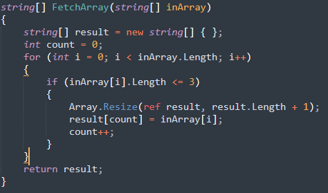

# Итоговая проверочная работа
## Описание решения
1. Сначала задается строковый массив (<kbd>array</kbd>) с произвольным наполнением
2. Затем создаем новый строковый массив(<kbd>array2</kbd>), заполнять который будет метод <kbd>FetchArray</kbd> значениями из <kbd>array</kbd>.
3. Исходный и полученный массив выводятся в консоль методом <kbd>PrintArray</kbd>.
### Описание метода FetchArray
<kbd>
    
</kbd>

В метод <kbd>FetchArray</kbd> принимается строковый массив(<kbd>inArray</kbd>). Сам метод состоит из:
- Пустого строкового массива <kbd>result</kbd>, который будет заполнятся искомыми значенями и будет возвращен в конце;
- Целочисленного значения <kbd>count</kbd>(нужен для заполнения нового массива слева направо);
- Цикла <kbd>for</kbd>, в котором проверяется каждое значение массива <kbd>array</kbd> на длинну; Если длинна значения меньше или равна <kbd>3</kbd>, то:
    * Размер массива <kbd>result</kbd> увеличивается на <kbd>1</kbd>(т.к. изначально он был пустой);
    * Элемент массива <kbd>result</kbd> с позицией <kbd>count</kbd> заполняется значением из найденого элемента <kbd>inArray</kbd>;
    * Значение <kbd>count</kbd> увеличивается на <kbd>1</kbd>;